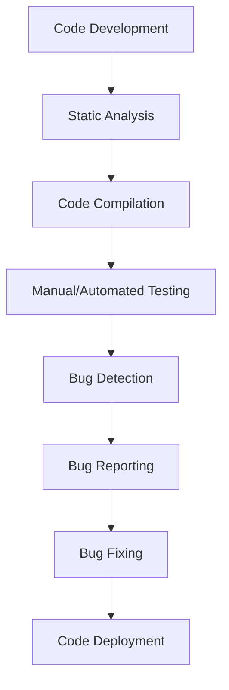

# Bugs Analysis : Documentation

### Author
|  Version   |   Author     |  Modifed   |      Comment      |    Reviewer      |
|------------|--------------|------------|-------------------|------------------|
|  V1        | Yuvraj Singh |            | Internal Review   | Siddharth Pawar  |
|  V2        | Yuvraj Singh |            | L0 Review         | Naveen Haswani |
|  V3        | Yuvraj Singh |            | L1 Review         | Deepak Nishad |
|  V4        | Yuvraj Singh |            | L2 Review         | Ashwani Singh |

## Table of Contents

1. Introduction

- [Introduction](#introduction)  
- [What is Bug Analysis?](#what-is-bug-analysis)  
- [Why is Bug Analysis Important?](#why-is-bug-analysis-important)  

2. Workflow

- [Workflow](#workflow)  
  - [1. Code Development](#1-code-development)  
  - [2. Static Analysis](#2-static-analysis)  
  - [3. Code Compilation](#3-code-compilation)  
  - [4. Manual/Automated Testing](#4-manualautomated-testing)  
  - [5. Bug Detection](#5-bug-detection)  
  - [6. Bug Reporting](#6-bug-reporting)  
  - [7. Bug Fixing](#7-bug-fixing)  
  - [8. Code Deployment](#8-code-deployment)  

3. Tools & Comparison

- [Tools for Bug Analysis in Java](#tools-for-bug-analysis-in-java)  
- [Comparison of Tools](#comparison-of-tools)  

4. Insights

 
- [Advantages of Bug Analysis](#advantages-of-bug-analysis)  
- [Proof of Concept (POC)](#proof-of-concept-poc) 
- [Best Practices](#best-practices)  

5. Wrap-Up

- [Conclusion](#conclusion)  
- [Contact Information](#contact-information)  
- [References](#references)  

## Introduction

This document serves as a practical guide for developers and DevOps teams to systematically identify, isolate, and resolve bugs in Java code. By incorporating tools like static analyzers, debuggers, and runtime monitors into CI pipelines, teams can catch issues early, prevent regressions, and maintain clean, secure, and efficient codebases. The practices and tools outlined here not only enhance development speed but also foster a culture of continuous improvement and collaboration.

## What is Bug Analysis?

Bug Analysis is the systematic process of detecting, isolating, and understanding faults (bugs) in a program. It involves:

- **Bug Identification**: Detecting the presence of a bug.
- **Bug Isolation**: Narrowing down the source of the bug.
- **Bug Resolution**: Fixing the issue at the source.
- **Root Cause Analysis (RCA)**: Understanding why the bug occurred.

## Why is Bug Analysis Important?

Without bug analysis, developers and teams may face several critical issues:

- **Unstable Applications**: Undetected bugs can lead to crashes or incorrect output.
- **Increased Debugging Time**: Bugs found later in the development lifecycle are more expensive and time-consuming to fix.
- **Poor User Experience**: Users encountering bugs may lose trust in the application.
- **Security Vulnerabilities**: Bugs like buffer overflows or injection flaws can compromise application security.
- **Team Inefficiency**: Time spent diagnosing old issues can slow down new feature development.

## Workflow

### 1. Code Development
The starting point of any software project. Developers write Java code to implement features and business logic based on requirements. Code quality at this stage heavily influences downstream analysis and debugging.

### 2. Static Analysis
Static analysis tools (like SpotBugs, PMD, Checkstyle) examine the code without executing it. These tools detect common issues such as syntax errors, code smells, unused variables, and security vulnerabilities early in the development cycle.

### 3. Code Compilation
Java source files are compiled into bytecode by the Java compiler. Compilation helps catch syntax errors and type mismatches that static analysis might not fully detect. If code doesn't compile, it cannot proceed to testing or deployment.

### 4. Manual/Automated Testing
After compilation, the code is tested either manually or through automated frameworks like JUnit or TestNG. These tests verify that the application behaves as expected under various conditions and inputs.

### 5. Bug Detection
During testing, bugs may surface as failed test cases, unexpected behavior, or exceptions. Detecting these issues is crucial before they reach production.

### 6. Bug Reporting
Detected bugs are logged and tracked using tools like Jira or GitHub Issues. Bug reports should include detailed information such as steps to reproduce, environment details, expected vs actual results, and logs.

### 7. Bug Fixing
Developers analyze the root cause of the bug and modify the code to fix the issue. Fixes are often followed by retesting to ensure the bug is resolved and no new issues have been introduced.

### 8. Code Deployment
Once all bugs are fixed and the code passes all tests, it is deployed to staging or production environments. This is typically done through CI/CD pipelines to ensure consistency and automation.

## Tools for Bug Analysis in Java

| Tool Name         | Type             | Description                                                             |
|------------------|------------------|-------------------------------------------------------------------------|
| FindBugs/SpotBugs | Static Analysis   | Detects potential bugs using bytecode inspection.                       |
| PMD               | Static Analysis   | Identifies common coding issues like unused variables, code duplication.|
| Checkstyle        | Code Style        | Ensures code adheres to defined standards.                              |
| SonarQube         | Static + Dynamic  | Analyzes code quality and provides a web-based dashboard.               |
| Eclipse IDE       | Manual Debugging  | Built-in Java debugger for line-by-line execution.                      |
| JUnit/TestNG      | Unit Testing      | Detects failures in functional logic.                                   |
| JaCoCo            | Code Coverage     | Measures how much code is tested.                                       |
| Sentry/Log4j      | Runtime Monitoring| Real-time bug tracking and logging.                                     |

## Comparison of Tools

| Feature         | SpotBugs   | PMD        | SonarQube  | JUnit/TestNG | Eclipse Debugger |
|----------------|------------|------------|------------|--------------|------------------|
| Static Analysis| Yes        | Yes        | Yes        | No           | No               |
| Dynamic Analysis| No        | No         | Yes        | Yes          | Yes              |
| Reporting       | Basic      | Basic      | Advanced   | Moderate     | Manual           |
| IDE Integration | Yes        | Yes        | Yes        | Yes          | Yes              |
| CI/CD Ready     | Yes        | Yes        | Yes        | Yes          | No               |

## Advantages of Bug Analysis

- **Improved Software Maintainability**: Makes it easier to enhance and extend code in the future.
- **Better Team Collaboration**: Shared understanding of quality metrics and areas of concern.
- **Informed Decision-Making**: Prioritize technical debt and feature development.
- **Audit and Compliance Readiness**: Ensure that your code adheres to standards and is traceable.
- **Reduced Post-Deployment Failures**: Avoid costly rollbacks or hotfixes.

## Proof of Concept (POC)

[Click here]() to learn how to perform bugs analysis in java code using SonarQube.

## Best Practices

- Automate static analysis using CI tools like Jenkins or GitHub Actions.
- Conduct frequent peer reviews focused on identifying logical bugs.
- Implement thorough unit and integration testing early in the SDLC.
- Monitor applications in production using logging frameworks.
- Maintain traceable documentation for all bug reports and fixes.

## Conclusion

Among the various tools discussed, **SonarQube** stands out due to its ability to perform both static and dynamic analysis, offer detailed dashboards, and integrate well with CI/CD pipelines. It is highly recommended for medium to large Java projects for continuous bug tracking and quality monitoring.

## Contact Information

| Name          | Email Address                              |
|---------------|--------------------------------------------|
| Yuvraj Singh  | yuvraj.singh.snaatak@mygurukulam.co         |

## References

| Description                                                  | Link                                                                                                           |
|--------------------------------------------------------------|----------------------------------------------------------------------------------------------------------------|
| Introduction to Java Debugging with Eclipse                  | [Visit](https://www.eclipse.org/community/eclipse_newsletter/2017/september/article2.php)                     |
| Understanding Java Exceptions and Error Handling             | [Visit](https://docs.oracle.com/javase/tutorial/essential/exceptions/)                                        |
| Java Anti-Patterns and Code Smells                           | [Visit](https://rules.sonarsource.com/java/tag/bug/)                                                          |
| SonarQube - Java Code Quality Guide                          | [Visit](https://docs.sonarsource.com/sonarqube/latest/analyzing-source-code/languages/java/)                 |
| SonarQube - Official Documentation Home                      | [Visit](https://docs.sonarsource.com/sonarqube/latest/)                                                      |
