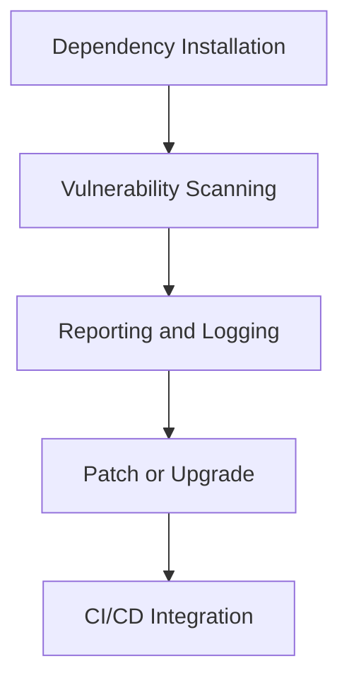

# Dependency Checks : Documentation

### Author

| Version | Author        | Modified | Comment         | Reviewer         |
|---------|---------------|----------|------------------|------------------|
| V1      | Yuvraj Singh  |          | Internal Review | Siddharth Pawar  |
| V2      | Yuvraj Singh  |          | L0 Review       | Naveen Haswani   |
| V3      | Yuvraj Singh  |          | L1 Review       | Deepak Nishad    |
| V4      | Yuvraj Singh  |          | L2 Review       | Ashwani Singh    |

---

## Table of Contents

1. Introduction

- [Introduction](#introduction)  
- [What are Python Dependency Vulnerability Checks?](#what-are-python-dependency-vulnerability-checks)  
- [Why are Dependency Checks Important?](#why-are-dependency-checks-important)  

2. Workflow

- [Workflow](#workflow)  
  - [1. Dependency Installation](#1-dependency-installation)  
  - [2. Vulnerability Scanning](#2-vulnerability-scanning)  
  - [3. Reporting and Logging](#3-reporting-and-logging)  
  - [4. Patch or Upgrade](#4-patch-or-upgrade)  
  - [5. CI/CD Integration](#5-cicd-integration)  

3. Tools & Comparison

- [Tools for Python Dependency Checks](#tools-for-python-dependency-checks)  
- [Comparison of Tools](#comparison-of-tools)  

4. Insights

- [Advantages of Dependency Checks](#advantages-of-dependency-checks)  
- [Proof of Concept (POC)](#proof-of-concept-poc)  
- [Best Practices](#best-practices)  

5. Wrap-Up

- [Conclusion](#conclusion)  
- [Contact Information](#contact-information)  
- [References](#references)  

---

## Introduction

This document serves as a guide to help developers, security engineers, and DevOps professionals understand and implement dependency vulnerability checks in Python projects. With the increasing use of third-party packages from PyPI, checking for known vulnerabilities is essential for maintaining a secure software supply chain.

---

## What are Python Dependency Vulnerability Checks?

Dependency vulnerability checks involve scanning installed or specified Python packages against public or curated databases of known security issues. These checks aim to:

- Detect outdated and vulnerable packages.
- Suggest safer versions or patches.
- Provide compliance and audit reports for secure SDLC.

---

## Why are Dependency Checks Important?

- **Supply Chain Security**: Prevent the use of malicious or compromised packages.
- **Vulnerability Management**: Identify known CVEs before they become attack vectors.
- **Compliance Readiness**: Satisfy security standards like ISO 27001, SOC 2, and OWASP.
- **Risk Mitigation**: Reduce risk of data breaches, DoS, or integrity loss from unpatched packages.
- **DevSecOps Alignment**: Embed security in the early stages of development.

---

## Workflow

### 1. Dependency Installation

Install project dependencies using `pip install` or from files like `requirements.txt`, `Pipfile`, or `pyproject.toml`.

### 2. Vulnerability Scanning

Run tools like `pip-audit` or `safety` to scan for CVEs or vulnerabilities from known databases.

### 3. Reporting and Logging

Generate and store reports in JSON or text format. These reports are used for tracking and compliance.

### 4. Patch or Upgrade

Update packages to patched versions or remove insecure dependencies where feasible.

### 5. CI/CD Integration

Incorporate scanning into GitHub Actions, Jenkins, or GitLab pipelines to enforce automated security gates.

---

## Tools for Python Dependency Checks

| Tool         | Maintainer      | Description |
|--------------|------------------|-------------|
| `pip-audit`  | PyPA             | Scans dependencies for known vulnerabilities using Python Advisory Database |
| `safety`     | PyUp             | Checks dependencies against a curated database of Python package vulnerabilities |
| `snyk`       | Snyk Ltd.        | Cloud-based scanner for multiple ecosystems with CLI support for Python |

---

## Comparison of Tools

| Feature                  | pip-audit          | safety            | snyk              |
|--------------------------|--------------------|--------------------|--------------------|
| Python-focused           | Yes                | Yes                | Yes                |
| Free & Open Source       | Yes                | Yes (basic only)   | No (Free Tier)     |
| CVE Database             | Python Advisory DB | PyUp DB            | Snyk DB            |
| JSON Output              | Yes                | Yes                | Yes                |
| CI/CD Integration        | Yes                | Yes                | Yes                |
| Custom Policies          | No                 | Yes (paid)         | Yes                |

---

## Advantages of Dependency Checks

- **Security Hardening**: Early detection prevents use of unsafe packages.
- **Auditable Artifacts**: JSON reports offer traceable documentation for audits.
- **Automated Risk Reduction**: Reduces manual work via CI/CD pipelines.
- **Reduced CVE Impact**: Proactive scanning limits exposure time to known threats.
- **Cross-Team Collaboration**: Shared scans foster awareness between Dev, Sec, and Ops teams.

---

## Proof of Concept (POC)

*[Visit here]() for a step-by-step guide on how to perform a Dependency Scan in python.*

---

## Best Practices

- Use **virtual environments** to isolate dependencies.
- Regularly update `requirements.txt` using `pip freeze > requirements.txt`.
- Integrate scans in **every PR or release pipeline**.
- Keep CI scans **fail-on-vulnerability** for critical CVEs.
- Use **multiple tools** in critical applications for wider coverage.
- Monitor **transitive dependencies** (e.g., packages used by your packages).
- Automate **patching of safe upgrades** with Renovate or Dependabot.

---

## Conclusion

Among the available tools, pip-audit is a lightweight, Python-native, and open-source solution ideal for most projects. While tools like Safety and Snyk offer additional features like custom policies and broader security coverage, pip-audit strikes the right balance between ease of use, accuracy, and CI/CD integration for reliable Python dependency vulnerability checks.

---

## Contact Information

| Name          | Email Address                              |
|---------------|--------------------------------------------|
| Yuvraj Singh  | yuvraj.singh.snaatak@mygurukulam.co        |

---

## References

| Description                                    | Link                                                                                         |
|------------------------------------------------|----------------------------------------------------------------------------------------------|
| pip-audit official documentation               | [Visit](https://pypi.org/project/pip-audit/)                                                 |
| safety CLI documentation                       | [Visit](https://pyup.io/safety/)                                                             |
| Python Packaging Security                      | [Visit](https://packaging.python.org/en/latest/guides/distributing-packages-using-setuptools/#security-best-practices) |
| Snyk for Python                                | [Visit](https://snyk.io/docs/python/)                                                        |
| OWASP Dependency-Check                         | [Visit](https://owasp.org/www-project-dependency-check/)                                     |
| SonarQube for Python                           | [Visit](https://docs.sonarsource.com/sonarqube/latest/analyzing-source-code/python/)         |
