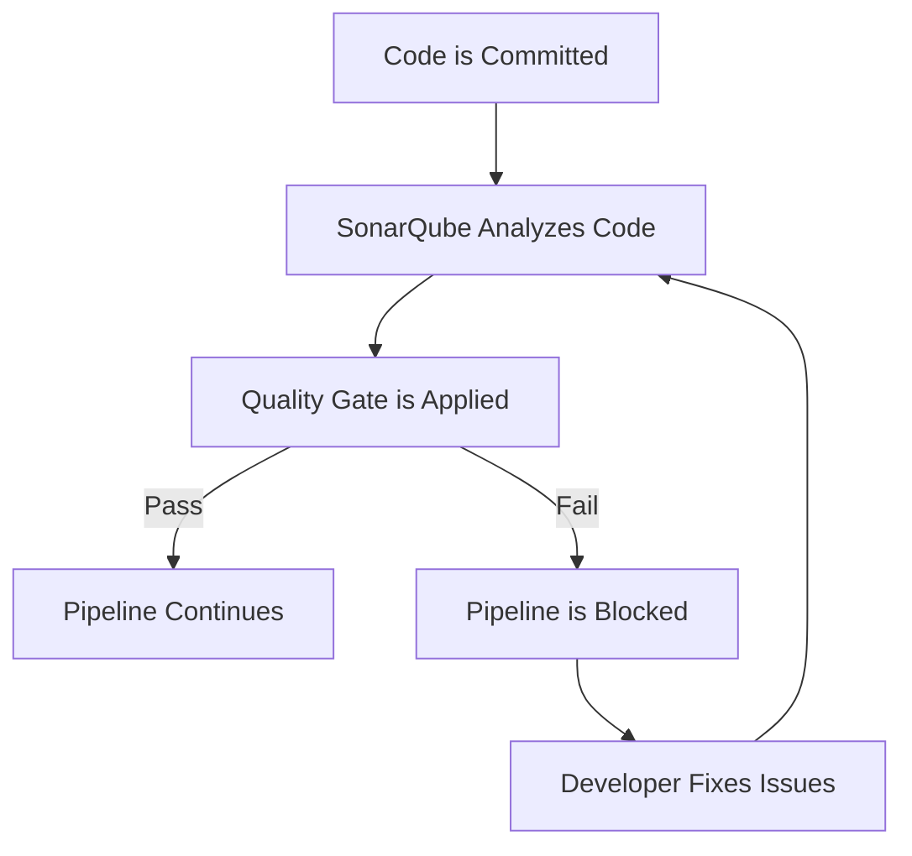

# SonarQube | Quality Gates


### Author
|  Version | Author        | Modified    | Comment           | Reviewer         |
|---------|---------------|-------------|--------------------|------------------|
| V1.0    | Yuvraj Singh  | --          | Internal Review      | Siddharth Pawar  |

---

## Table of Contents

<details>
<summary>1. Introduction</summary>

- [Introduction](#introduction)  
- [What is a Quality Gate?](#what-is-a-quality-gate)  
- [Why Use Quality Gates?](#why-use-quality-gates)

</details>

<details>
<summary>2. Quality Gates in Depth</summary>

- [Workflow](#workflow-diagram)  
- [Identification of Quality Gates](#identification-of-quality-gates)  
- [Default Quality Gates](#default-quality-gates)  
- [Custom Quality Gates](#custom-quality-gates)  
- [Advantages](#advantages)  
- [Best Practices](#best-practices)

</details>

<details>
<summary>3. Wrap-up</summary>

- [Conclusion](#conclusion)  
- [Contact](#contact)  
- [References](#references)

</details>

---

## Introduction

This document explains the concept of **Quality Gates** in **SonarQube**, a vital feature for enforcing code quality and compliance across your CI/CD pipelines. It provides insight into what quality gates are, why they matter, and how they improve your development lifecycle.

---

## What is a Quality Gate?

A **Quality Gate** in SonarQube is a set of predefined conditions that code must meet to be considered acceptable. These gates assess the results of a code scan and determine whether the code passes or fails the quality check.

---

## Why Use Quality Gates?

| Benefit                        | Description                                                                 |
|-------------------------------|-----------------------------------------------------------------------------|
| **Enforces Standards**        | Ensures every commit or merge meets coding standards and security baselines. |
| **CI/CD Integration**         | Automatically fails pipelines when code quality is poor.                    |
| **Prevent Technical Debt**    | Stops poorly written code from progressing to production.                   |
| **Increased Developer Awareness** | Developers receive immediate feedback about code quality.            |
| **Better Maintainability**    | Cleaner code leads to easier maintenance and fewer bugs in the long run.    |

---

## Workflow Diagram



---

## Identification of Quality Gates

In **SonarQube**, Quality Gates are identified and managed at the **project** or **portfolio** level.

You can find the applied Quality Gate by navigating to:

```
Project Settings → Quality Gate
```

- The **status** (`Passed` / `Failed`) of a Quality Gate is displayed after each scan on the **project dashboard**.
- If a gate is **not met**, SonarQube provides detailed **metrics and conditions** that triggered the failure.

---

## Default Quality Gates

SonarQube includes a built-in Quality Gate called **"Sonar way"**, which consists of essential rules for evaluating new code. This gate promotes best practices and is suitable for most projects.

### **Sonar way – Default Conditions:**

| Metric                     | Condition     |
|----------------------------|---------------|
| New Bugs                   | 0             |
| New Vulnerabilities        | 0             |
| New Code Coverage          | ≥ 80%         |
| Code Duplication           | ≤ 3%          |
| Maintainability Rating     | A             |
| Reliability Rating         | A             |
| Security Rating            | A             |

This default gate encourages clean coding practices right from the start of a project.

---

## Custom Quality Gates

Custom Quality Gates allow teams to define their **own criteria** based on project needs, coding practices, and risk profiles. They are particularly useful in scenarios such as:

- Teams with **different risk tolerances**
- Projects with a **legacy codebase**, where strict defaults are impractical
- Need to monitor **project-specific metrics** like custom rule violations or technical debt ratio

---

### Steps to Create a Custom Quality Gate

1. Go to:  
   `Administration → Quality Gates`
2. Click on **“Create”**
3. Provide a **name** for the new Quality Gate
4. **Add conditions** such as:
   - Minimum coverage percentage
   - Code smell thresholds
   - Maximum allowed duplications
5. **Assign** the newly created gate to your project(s)

---

## Advantages

| **Advantage**                   | **Description**                                                                                |
| ------------------------------- | ---------------------------------------------------------------------------------------------- |
| **Automated Quality Control**   | Enforces predefined code quality standards automatically during analysis.                      |
| **Immediate Feedback**          | Provides real-time feedback to developers after every code commit or scan.                     |
| **CI/CD Integration**           | Seamlessly integrates with Jenkins, GitLab CI, and other pipelines to enforce quality gates.   |
| **Reduces Technical Debt**      | Prevents bad code from being merged, thus reducing long-term maintenance overhead.             |
| **Customizable Criteria**       | Teams can define and tune quality gates based on severity levels, coverage, duplications, etc. |
| **Improves Code Reliability**   | Promotes best coding practices, resulting in more secure and stable code.                      |
| **Supports Multiple Languages** | Quality gates work across many languages, including Java, Python, JavaScript, and more.        |

---

## Best Practices

| **Best Practice**                   | **Description**                                                                                 |
| ----------------------------------- | ----------------------------------------------------------------------------------------------- |
| **Define Clear Thresholds**         | Set strict but realistic thresholds for bugs, vulnerabilities, code coverage, and duplications. |
| **Use 'Fail' as Default Behavior**  | Configure quality gates to fail builds when critical metrics are violated.                      |
| **Treat Warnings Seriously**        | Address warnings proactively to avoid future escalations to bugs or vulnerabilities.            |
| **Review and Update Regularly**     | Periodically revise quality gate rules to adapt to evolving project requirements.               |
| **Integrate Early in the Pipeline** | Place SonarQube scans early in the CI process to catch issues before review or deployment.      |
| **Educate Your Team**               | Ensure all developers understand quality gate criteria and why they matter.                     |
| **Leverage Quality Profiles**       | Use customized quality profiles aligned with team standards to reinforce meaningful rules.      |

---

## Conclusion

From the Quality Gates analysis of `Salayr API`, I found that the code needs some cleanup—like making it easier to understand, removing repeated parts, and using consistent names and comments. Also, using commit sign-off helps make sure the code is safe and properly checked in the CI process.

---

| Name          | Email Address                              |
|---------------|--------------------------------------------|
| Yuvraj Singh  | yuvraj.singh.snaatak@mygurukulam.co         |

---

## References

- [SonarQube Documentation – Quality Gates](https://docs.sonarsource.com/sonarqube/latest/project-administration/quality-gates/)
- [SonarQube Rules and Quality Profiles](https://docs.sonarsource.com/sonarqube/latest/quality-profiles/rules/)
- [SonarQube Supported Languages](https://docs.sonarsource.com/sonarqube/latest/requirements/requirements/)
